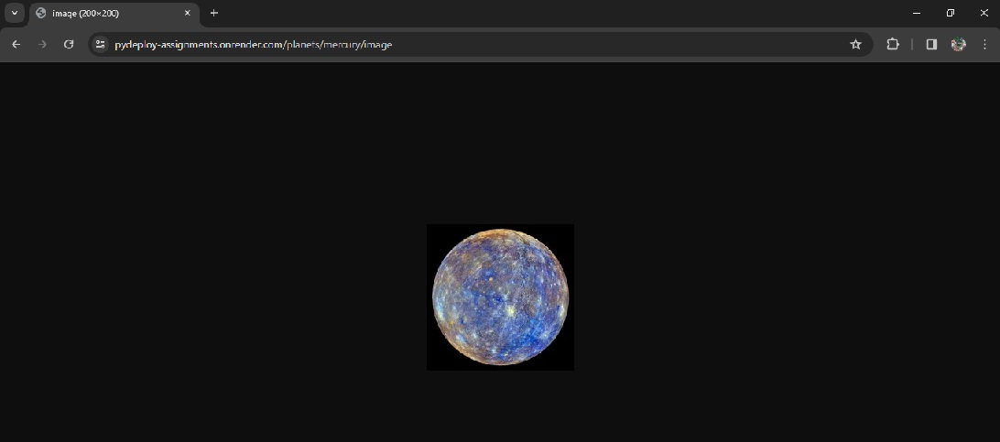

# PyDeploy_assignments
## The 3th assignments related to the PyDeploy course.
## Hello FastAPI.. 👋

### An API for information of the Solar system planets.

- It's live server url: https://pydeploy-assignments.onrender.com

  - endpoint / : Introduction of the Solar system API
  - endpoint /planets: List of names of solar system's main planets
  - endpoint /planets/{planet_name}: Information about the specific planet that you determined with {planet_name}
  - endpoint /planets/{planet_name}/image: An image of the specific planet that you determined with {planet_name}
    - For example, result of "https://pydeploy-assignments.onrender.com/planets/mercury/image" is:
    

